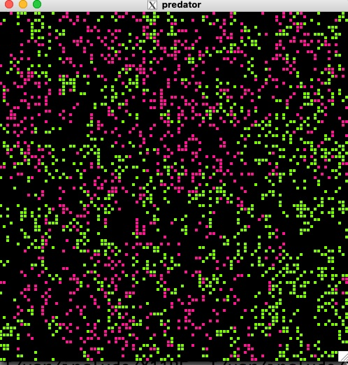

# Predator Cellular Automaton

This code simulates a predator-prey ecosystem Cellular Automaton, a
complex system based on the RWCA model [1,2,3].  It uses [GSL](https://www.gnu.org/software/gsl/) for the random number generator and [EGGX](https://www.ir.isas.jaxa.jp/~cyamauch/eggx_procall/index.html) for graphics.

- Predators and prey walk around the 2D lattice following the RWCA rules.  As they move, predators and prey undergo a realistic, gradual reduction in their energy points, accurately reflecting the energy expenditure in a natural ecosystem.

- A predator will consume prey at the nearest neighbor sites with a certain probability, where the nearest neighbors refer to N, E, S, and W sites, and eliminate the prey.

- A predator will probably have a baby predator when it meets another predator in neighboring sites.

- A prey will also have a baby prey with some probability when it meets another prey in neighboring sites.

This figure shows a snapshot of the predator (red) and prey (green) ecosystem.

#### Manual (Japanese)
- Please take a look at the Sec. 6.5 of the book [C言語によるコンピュータシミュレーション](http://web.cc.iwate-u.ac.jp/~nisidate/main.pdf), for more information.
 

[1] [Cellular automaton model for random walkers](https://journals.aps.org/prl/abstract/10.1103/PhysRevLett.77.1675)

[2] [Cellular automaton model for biased diffusive traffic flow](https://journals.jps.jp/doi/abs/10.1143/JPSJ.65.3415)

[3] [Probabilistic Cellular Automaton for Random Walkers](https://journals.jps.jp/doi/abs/10.1143/JPSJ.69.1352)

